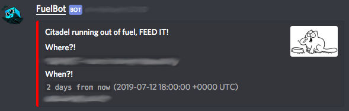
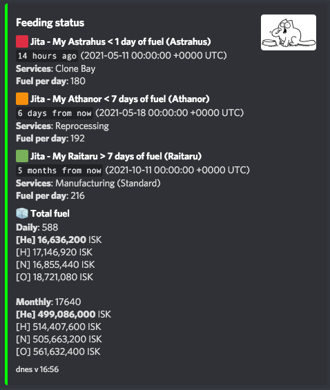

# EVE-FuelBot

I'm a discord bot, that will notify you when any of your structures is running out of fuel.

When your structure is running out:  


When you ask me for `!fuel`:  


# I can
1. Check your structures every `check_interval`
2. Notify you when structure will run out of fuel within `refuel_notification`
3. Remind you every `notify_interval`, because you will forget you silly human
4. List all structures and their fuel state with colors so your puny brain can comprehend
5. List all services online in your structures
6. Calculate the fuel required for you
7. Tell you how much it will cost, and which fuel is cheaper
## Set-up
1. Download binary for your architecture in `releases` section.

### Part 1 - Get the Acess Tokens
2. Go to [EVE developer portal](https://developers.eveonline.com/applications) and create a EVE app for the bot
   1. Grab the `Client ID` and `Secret Key`
   2. Set `Callback URL` to `    http://localhost:3000/callback `
   3. Add these scopes to the APP: `publicData, esi-universe.read_structures.v1, esi-corporations.read_structures.v1`
3. Go to [Discord Developer Portal](https://discordapp.com/developers/applications) and create new APP.
   1. Add `Bot` to this APP.
   2. Make the `bot` `public` so it can be added to your corp discord.
   3. Grab the `Token`
4. Create RANDOM string for SESSION storage (you can use openssl, or just make something by hand)

### Part 2 - Login to EVE with the bot
4. Run this command and fill in the missing variables with what you got in `Part 1`:
    ```
    fuelbot login -s "RANDOM_STRING" --eve_client_id="FILLME" --eve_sso_secret="FILLME"
    ```
    This will open web browser, and will authorize you with EVE account that can manage structures.
    When it is successfull, you can close the browser tab, and it will save the authentization information
    in `auth.bin` file.

### Part 3 - Run the bot and invite it to discord
5. Copy the discord ChannelID where you want your bot (you have to enable DEV mode)
6. Test-run the bot on some test server so you don't spam everyone:
    ```
    fuelbot run -s "RANDOM_STRING" --discord_auth_token="FILLME" --discord_channel_id="FILLME" --eve_client_id="FILLME" --eve_sso_secret="FILLME"
    ```
    You can modify these parameters to make the bot trigger a message:
    ```
    --check_interval duration        how often to check EVE ESI API (default 1H) (default 1h0m0s)
    --notify_interval duration       how often to spam discord (default 12H) (default 12h0m0s)
    --refuel_notification duration   how far in advance would you like to be notified about the fuel (default 5 days) (default 120h0m0s)
    ```
7. Go to [Discord Developer Portal](https://discordapp.com/developers/applications) and create new APP.
   1. Get the invite link for your bot: `OAuth2` section
      1. Click on `Scopes`: `bot`
      2. `Text Permissions`: `Send Messages`
      3. Open the `URL` that was generated in `Scopes` block, and invite your bot to some server.
8. If you managed to trigger a message, you're good to continue to the next part.
   
### Part 4 - Run the bot on some server
I prepared `systemd` (under /debian/) unit, but you have to copy it and the binary by hand. If someone wants to create
a `.deb` file or some other package, feel free to do so.

If you are successfull, you should see the Bot's icon in the discord users list in the channel.

## No need to say thanks, that is what ISK is for.
If you like this bot and use it, consider donating some ISK to `Lukas Nemec`. Thanks.
